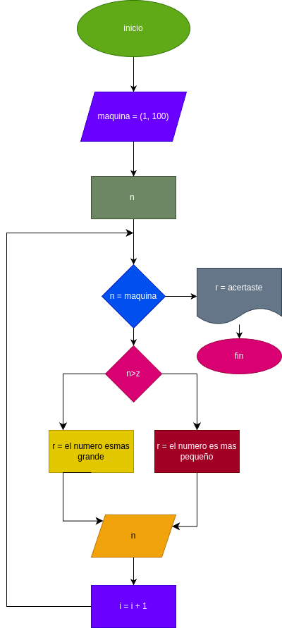

# juego_adivina_numero
un juego en el que debes adivinar el numero que la maquina te indica 
medinte pistas mientras te vayas equivocando 

# analisis

## input 

### variables

n = el numero que indica el usuario

z = numero que la maquina escoge para adivinar 

## processing 

  = random.randint(1, 100) #genera un numero entre 1 y 100

i = 1
if n == z:
    r ="ganaste el juego"
else:
    while n < z or n > z:
        i = i + 1 
        if n < z :
            r ="el numero es mas grande"
        else:
            r ="el numero es mas pequeño"
        print(r)
        n = int(input("dijite otro numero "))

print("acertaste a :" + str(i) + " intentos")

##